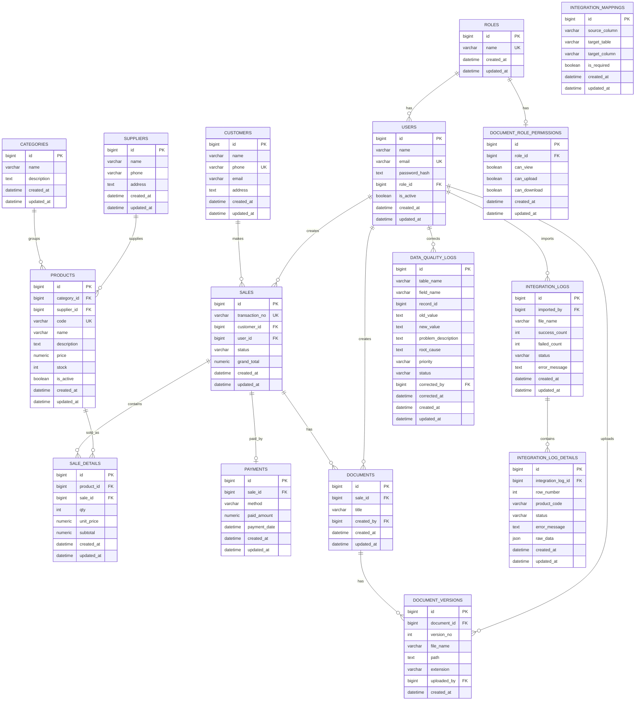

# Entity Relationship Diagram

## Overview

Dokumen ini menampilkan ERD Sistem Pengelolaan Data Penjualan berdasarkan entity dan relationship yang telah didefinisikan.

---

## ERD Diagram

---

## Notes

- `integration_mappings` tidak memiliki foreign key karena berfungsi sebagai konfigurasi pemetaan CSV.
- `sale_details.subtotal` adalah nilai turunan dari `qty * unit_price`.
- `sales.grand_total` adalah nilai turunan dari total `sale_details.subtotal`.
- `payments.sale_id` memiliki unique constraint agar satu transaksi maksimal memiliki satu pembayaran.
- `document_role_permissions.role_id` memiliki unique constraint agar satu role hanya memiliki satu konfigurasi izin dokumen.
- `document_versions` menyimpan riwayat versi dokumen.
- `data_quality_logs.corrected_by` dapat bernilai null jika user tidak tersedia.
